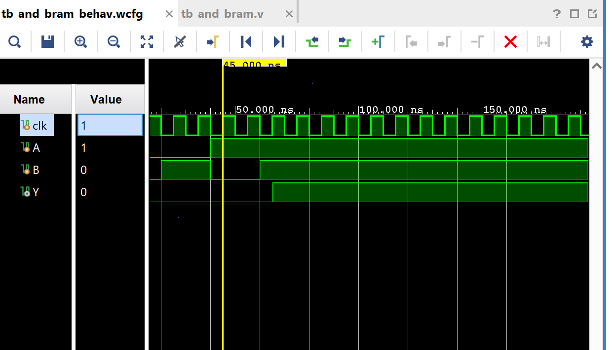

# AND Gate Implemented via Block RAM (BRAM)

Instead of building an AND gate from logic primitives, this design
implements it as a **lookup table stored in Block RAM**: the two inputs
form the read address, and the RAM's pre-loaded contents at that address
are the answer. A simple but genuine illustration of using BRAM as a
combinational function generator.

## Contents

1. [Source (`src/and_bram.v`, `src/tb_and_bram.v`)](src)
2. [IP (`ip/blk_mem_gen_0.xci`)](ip/blk_mem_gen_0.xci)
3. [Constraints (`constraints/and_bram.xdc`)](constraints/and_bram.xdc)
4. [Reports (`reports/`)](reports)
5. [Simulation (`simulation/waveform.png`)](simulation/waveform.png)
6. [Conclusion](CONCLUSION.md)

## Design

- `clk` — clock, drives the BRAM's read port
- `A`, `B` — 1-bit inputs, concatenated to form the 2-bit read address
- `Y` — AND output, read from the BRAM

## How It Works

`{A,B}` addresses a 4-entry × 1-bit single-port BRAM (`blk_mem_gen_0`,
generated by Vivado's Block Memory Generator IP). The RAM is pre-loaded
via a `.coe` file with the AND truth table at each address:

| Address `{A,B}` | Contents (Y) |
|------------------|--------------|
| 00 | 0 |
| 01 | 0 |
| 10 | 0 |
| 11 | 1 |

Since the RAM is read-only in this design (`wea = 1'b0`, `dina` unused),
it behaves exactly like a combinational AND gate — just implemented as
memory contents instead of gates. Note the BRAM read is registered
(synchronous), so `Y` reflects the address from the *previous* clock edge,
not the current one — worth keeping in mind if timing this against a pure
combinational AND gate.

## IP Core

- `ip/blk_mem_gen_0.xci` — Vivado Block Memory Generator IP customization: single-port RAM, 4 × 1-bit.
- The `.coe` file that actually initializes the RAM contents with the AND truth table is referenced by the IP but not included in this repo (it lives outside the project tree it was generated from). Regenerate it with the truth table above if reproducing this project from scratch.

## Testbench

`src/tb_and_bram.v` steps through all 4 input combinations, holding `A=1,
B=1` (the only case where `Y=1`) for an extended period at the end.

## Simulation Waveform

## Files

- `src/and_bram.v` — AND gate via BRAM lookup.
- `src/tb_and_bram.v` — Testbench sweeping all 4 input combinations.
- `ip/blk_mem_gen_0.xci` — Block Memory Generator IP customization file.
- `constraints/and_bram.xdc` — Pin/IO constraints used for implementation on the target FPGA.
- `reports/utilization.rpt` — Post-synthesis resource utilization report.
- `reports/timing.rpt` — Post-implementation timing summary.
- `reports/power.rpt` — Post-implementation power summary.
- `simulation/waveform.png` — Vivado behavioral simulation waveform.

## Tools Used

- Xilinx Vivado 2025.1
- Target device: xc7s50csga324-1

## How to Reproduce

1. Open Vivado and create a new RTL project.
2. Add `src/and_bram.v` as a design source and `src/tb_and_bram.v` as a simulation source.
3. Generate a Block Memory Generator IP core matching `ip/blk_mem_gen_0.xci` (single-port RAM, 4 × 1-bit), and initialize it with a `.coe` file containing the AND truth table.
4. Add `constraints/and_bram.xdc` as a constraints file.
5. Run Behavioral Simulation to verify functionality against the testbench.
6. Run Synthesis → Implementation → Generate Bitstream.
7. Export the utilization, timing, and power reports into the `reports/` folder.

See `CONCLUSION.md` for a summary of the results.
