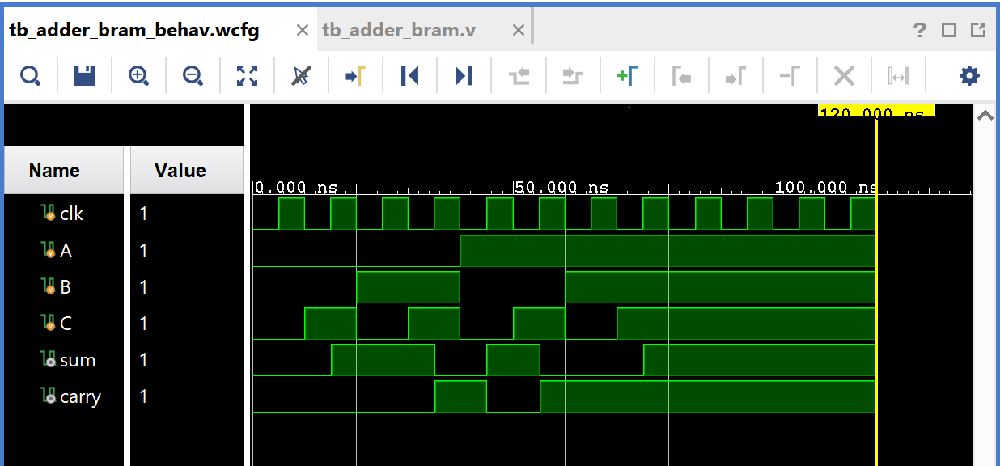

# Full Adder Implemented via Block RAM (BRAM)

Same idea as [`01_AND_BRAM`](../01_AND_BRAM), applied to a full adder: the
three inputs address a lookup table stored in Block RAM, and the RAM's
contents at that address directly give the sum and carry.

## Contents

1. [Source (`src/adder_bram.v`, `src/tb_adder_bram.v`)](src)
2. [IP (`ip/blk_mem_gen_1.xci`)](ip/blk_mem_gen_1.xci)
3. [Constraints (`constraints/adder_bram.xdc`)](constraints/adder_bram.xdc)
4. [Reports (`reports/`)](reports)
5. [Simulation (`simulation/waveform.png`)](simulation/waveform.png)
6. [Conclusion](CONCLUSION.md)

## Design

- `clk` — clock, drives the BRAM's read port
- `A`, `B`, `C` — 1-bit inputs, concatenated to form the 3-bit read address
- `sum`, `carry` — full adder outputs, read from the BRAM

## How It Works

`{A,B,C}` addresses an 8-entry × 2-bit single-port BRAM (`blk_mem_gen_1`),
pre-loaded via a `.coe` file with the full adder truth table:

| Address `{A,B,C}` | `{sum,carry}` |
|---------------------|----------------|
| 000 | 00 |
| 001 | 10 |
| 010 | 10 |
| 011 | 01 |
| 100 | 10 |
| 101 | 01 |
| 110 | 01 |
| 111 | 11 |

## ⚠️ Design Note: Redundant/Conflicting Output Assignment

The module declares `wire [1:0] dout;` but never actually connects it to
the BRAM instance — `douta` is wired directly to `{sum,carry}` in the
port map. Separately, there's also `assign {sum,carry} = dout;`, which
assigns `sum`/`carry` from that same unconnected `dout` wire. That means
`sum` and `carry` currently have **two drivers**: the valid one from the
BRAM's `douta` port, and a second one from the floating, never-driven
`dout` wire. This is worth fixing — either connect `douta(dout)` and drop
the direct port connection, or remove the unused `dout` wire and the
`assign` statement entirely, keeping only the direct port connection.
Check `simulation/waveform.png` closely for any `X` on `sum`/`carry` that
this might be causing.

## Testbench

`src/tb_adder_bram.v` sweeps all 8 input combinations of `{A,B,C}`.

## Simulation Waveform

## Files

- `src/adder_bram.v` — Full adder via BRAM lookup (see design note above).
- `src/tb_adder_bram.v` — Testbench sweeping all 8 input combinations.
- `ip/blk_mem_gen_1.xci` — Block Memory Generator IP customization file.
- `constraints/adder_bram.xdc` — Pin/IO constraints used for implementation on the target FPGA.
- `reports/utilization.rpt` — Post-synthesis resource utilization report.
- `reports/timing.rpt` — Post-implementation timing summary.
- `reports/power.rpt` — Post-implementation power summary.
- `simulation/waveform.png` — Vivado behavioral simulation waveform.

## Tools Used

- Xilinx Vivado 2025.1
- Target device: xc7s50csga324-1

## How to Reproduce

1. Open Vivado and create a new RTL project.
2. Add `src/adder_bram.v` as a design source and `src/tb_adder_bram.v` as a simulation source.
3. Generate a Block Memory Generator IP core matching `ip/blk_mem_gen_1.xci` (single-port RAM, 8 × 2-bit), and initialize it with a `.coe` file containing the full adder truth table above.
4. Add `constraints/adder_bram.xdc` as a constraints file.
5. Run Behavioral Simulation to verify functionality against the testbench.
6. Run Synthesis → Implementation → Generate Bitstream.
7. Export the utilization, timing, and power reports into the `reports/` folder.

See `CONCLUSION.md` for a summary of the results.
