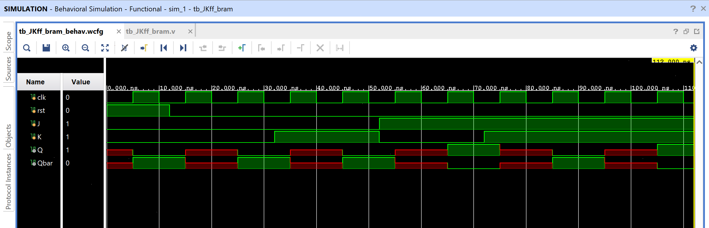

# JK Flip-Flop with Next-State Logic in Block RAM (BRAM)

A JK flip-flop where the next-state logic itself — not just a static
truth table — is stored in Block RAM. `{J, K, Q}` (current inputs plus
current state) addresses the RAM, and its contents give the next
`{Q, Qbar}`. The actual state register is still a normal clocked
`always` block; only the combinational next-state function is replaced
by a memory lookup.

## Contents

1. [Source (`src/JK_FF.v`, `src/tb_JKff_bram.v`)](src)
2. [IP (`ip/blk_mem_gen_0.xci`)](ip/blk_mem_gen_0.xci)
3. [Constraints (`constraints/FF_bram.xdc`)](constraints/FF_bram.xdc)
4. [Reports (`reports/`)](reports)
5. [Simulation (`simulation/waveform.png`)](simulation/waveform.png)
6. [Conclusion](CONCLUSION.md)

## Design

- `clk` — clock (rising-edge triggered)
- `rst` — synchronous reset (forces `Q=0, Qbar=1`)
- `J`, `K` — control inputs
- `Q`, `Qbar` — flip-flop outputs

## How It Works

`{J,K,Q}` (3 bits) addresses an 8-entry × 2-bit single-port BRAM
(`blk_mem_gen_0`), pre-loaded via a `.coe` file with the JK flip-flop's
next-state table:

| Address `{J,K,Q}` | `{Q_next,Qbar_next}` | Behavior |
|----------------------|------------------------|----------|
| 000 | 00 | hold (Q=0 stays 0) |
| 001 | 10 | hold (Q=1 stays 1) |
| 010 | 00 | reset |
| 011 | 00 | reset |
| 100 | 10 | set |
| 101 | 10 | set |
| 110 | 10 | toggle (Q=0 → 1) |
| 111 | 01 | toggle (Q=1 → 0) |

On each rising `clk` edge, if `rst` is low, `{Q,Qbar}` is loaded directly
from the BRAM's output (`dout`) — no separate combinational next-state
logic is written in RTL; the lookup table *is* the next-state function.

## Testbench

`src/tb_JKff_bram.v` applies a synchronous reset, then walks through
hold (`J=K=0`) → reset (`J=0,K=1`) → set (`J=1,K=0`) → toggle
(`J=K=1`), each held for 20-40ns.

## Simulation Waveform

Captured from Vivado's Behavioral Simulation waveform viewer, running
`tb_JKff_bram.v` against the design. `Q`/`Qbar` show red (undefined) only
briefly right after reset deasserts and around clock edges — normal
delta-cycle behavior before the registered output settles — then track
the expected hold/reset/set/toggle sequence.

## Files

- `src/JK_FF.v` — JK flip-flop with BRAM-based next-state lookup.
- `src/tb_JKff_bram.v` — Testbench exercising reset, hold, reset, set, and toggle.
- `ip/blk_mem_gen_0.xci` — Block Memory Generator IP customization file.
- `constraints/FF_bram.xdc` — Pin/IO constraints used for implementation on the target FPGA.
- `reports/utilization.rpt` — Post-synthesis resource utilization report.
- `reports/timing.rpt` — Post-implementation timing summary.
- `reports/power.rpt` — Post-implementation power summary.
- `simulation/waveform.png` — Vivado behavioral simulation waveform.

## Tools Used

- Xilinx Vivado 2025.1
- Target device: xc7s50csga324-1

## How to Reproduce

1. Open Vivado and create a new RTL project.
2. Add `src/JK_FF.v` as a design source and `src/tb_JKff_bram.v` as a simulation source.
3. Generate a Block Memory Generator IP core matching `ip/blk_mem_gen_0.xci` (single-port RAM, 8 × 2-bit), and initialize it with a `.coe` file containing the next-state table above.
4. Add `constraints/FF_bram.xdc` as a constraints file.
5. Run Behavioral Simulation to verify functionality against the testbench.
6. Run Synthesis → Implementation → Generate Bitstream.
7. Export the utilization, timing, and power reports into the `reports/` folder.

See `CONCLUSION.md` for a summary of the results.
