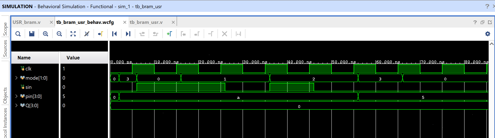

# Universal Shift Register (USR) via Block RAM (BRAM)

A 4-bit universal shift register (hold / shift-right / shift-left /
parallel-load) where the register storage itself is a **single-address
BRAM used as a writable register**, not a lookup table. This is a
different BRAM usage pattern from every other design in
`designs-using-bram-ip` so far — here, BRAM replaces the flip-flops
directly, rather than replacing combinational logic.

## Contents

1. [Source (`src/USR_bram.v`, `src/tb_bram_usr.v`)](src)
2. [IP (`ip/blk_mem_gen_0.xci`)](ip/blk_mem_gen_0.xci)
3. [Constraints (`constraints/usr_bram.xdc`)](constraints/usr_bram.xdc)
4. [Reports (`reports/`)](reports)
5. [Simulation (`simulation/waveform.png`)](simulation/waveform.png)
6. [Conclusion](CONCLUSION.md)

## Design

- `clk` — input clock
- `mode[1:0]` — operating mode: `00`=hold, `01`=shift right, `10`=shift left, `11`=parallel load
- `sin` — serial input (used during shifts)
- `pin[3:0]` — parallel input (used during parallel load)
- `Q[3:0]` — register output

## How It Works

Instead of 4 flip-flops, the register's current value lives in a **single
memory word** of a 2-deep × 4-bit BRAM (`blk_mem_gen_0`), always read and
written at the fixed address `0`. Each clock cycle:

1. Combinational logic computes `next` from the current BRAM output (`dout`) and the mode/inputs — hold, shift right, shift left, or parallel load.
2. `next` is written back into the BRAM at address 0 (`wea=1'b1` every cycle), so the BRAM's contents *are* the register state.
3. `Q` is simply the BRAM's output.

| mode | Behavior | Next value |
|------|----------|------------|
| 00 | Hold | `dout` (unchanged) |
| 01 | Shift right | `{sin, dout[3:1]}` |
| 10 | Shift left | `{dout[2:0], sin}` |
| 11 | Parallel load | `pin` |

## ⚠️ Note: Duplicate IP Customization

This project contains **two** Block Memory Generator customizations that
both generate a module named `blk_mem_gen_0` — one with no `.coe` file
loaded, and one loading `usr.mem.coe`. This is a leftover from
regenerating the IP core in Vivado (the old customization wasn't deleted).
Only the version with the `.coe` file is included here
(`ip/blk_mem_gen_0.xci`), since it's the one that actually initializes the
register to a defined value on power-up; the stale, uninitialized
duplicate was left out. Worth cleaning up the original Vivado project so
only one customization remains.

## ⚠️ Note on the Internal Clock Divider

Same 27-bit clock-divider pattern seen in this repo's [JK flip-flop](../../sequential/03_JK_FF),
[traffic light controller](../../projects/01_TRAFFIC_LIGHT_CONTROLLER),
and [ring counter](../04_RING_COUNTER_BRAM) — `clk_out = cnt[26]` should
take roughly 2²⁶ `clk` cycles to toggle, yet the captured waveform shows
the register updating within the first ~80ns. Same discrepancy, worth
resolving across all of these designs together.

## Testbench

`src/tb_bram_usr.v` runs 8 directed steps: parallel load → hold → shift
right (×2) → shift left (×2) → parallel load → hold, checking `Q` against
expected values in comments after each step.

## Simulation Waveform

Captured from Vivado's Behavioral Simulation waveform viewer, running
`tb_bram_usr.v` against the design.

## Files

- `src/USR_bram.v` — Universal shift register with BRAM-based storage.
- `src/tb_bram_usr.v` — Testbench with 8 directed test steps.
- `ip/blk_mem_gen_0.xci` — Block Memory Generator IP customization file (the active one — see note above).
- `constraints/usr_bram.xdc` — Pin/IO constraints used for implementation on the target FPGA.
- `reports/utilization.rpt` — Post-synthesis resource utilization report.
- `reports/timing.rpt` — Post-implementation timing summary.
- `reports/power.rpt` — Post-implementation power summary.
- `simulation/waveform.png` — Vivado behavioral simulation waveform.

## Tools Used

- Xilinx Vivado 2025.1
- Target device: xc7s50csga324-1

## How to Reproduce

1. Open Vivado and create a new RTL project.
2. Add `src/USR_bram.v` as a design source and `src/tb_bram_usr.v` as a simulation source.
3. Generate a Block Memory Generator IP core matching `ip/blk_mem_gen_0.xci` (single-port RAM, 2 × 4-bit, single address used), and initialize it with a `.coe` file if a defined power-on value is desired.
4. Add `constraints/usr_bram.xdc` as a constraints file.
5. Run Behavioral Simulation to verify functionality against the testbench.
6. Run Synthesis → Implementation → Generate Bitstream.
7. Export the utilization, timing, and power reports into the `reports/` folder.

See `CONCLUSION.md` for a summary of the results.
