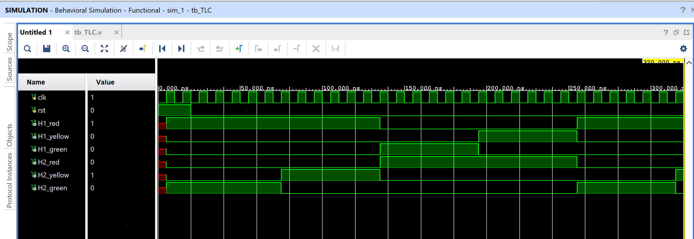

# Traffic Light Controller

A 4-state FSM that controls traffic lights at a two-way intersection (H1
and H2), cycling through the standard red/yellow/green sequence with each
direction offset so only one direction has green (or yellow) at a time.

## Contents

1. [Source (`src/Traffic_light_controller.v`, `src/clk_divider.v`, `src/tb_TLC.v`)](src)
2. [Constraints (`constraints/TLC.xdc`)](constraints/TLC.xdc)
3. [Reports (`reports/`)](reports)
4. [Simulation (`simulation/waveform.png`)](simulation/waveform.png)
5. [Conclusion](CONCLUSION.md)

## Design

- `clk` — input clock
- `H1_red, H1_yellow, H1_green` — light outputs for direction 1
- `H2_red, H2_yellow, H2_green` — light outputs for direction 2

## FSM States

| State | H1 | H2 |
|-------|----|----|
| s0 | red | green |
| s1 | red | yellow |
| s2 | green | red |
| s3 | yellow | red |

The FSM advances `s0 → s1 → s2 → s3 → s0 → ...` once an internal timer
(`count`, counting up to `delay = 5`) expires.

## ⚠️ Design Notes / Discrepancies Worth Investigating

- **No `rst` port on the module:** `src/tb_TLC.v` connects `.rst(rst)` when instantiating the design, but `Traffic_light_controller` doesn't declare an `rst` input at all — only `clk` and the six light outputs. That connection is effectively a no-op, so this design currently has no working reset; `state`, `count`, and `cnt` all start from whatever their simulator-default initial values are.
- **Clock divider vs. observed timing:** The module includes a 27-bit counter (`cnt`) intended to divide `clk` down to a much slower `clk_out = cnt[26]`, which the FSM timer is written to run from. Based on that divider, `clk_out` shouldn't toggle for roughly 2²⁶ `clk` cycles. However, the captured simulation waveform shows the FSM state changing every ~10-15 `clk` cycles — this is the same discrepancy observed in this repo's [JK flip-flop](../../sequential/03_JK_FF), which uses the identical clock-divider snippet. Worth investigating whether the divider is actually intended to gate the FSM, or if it's leftover/copy-pasted boilerplate.

## Simulation Waveform

Captured from Vivado's Behavioral Simulation waveform viewer, running
`tb_TLC.v` against the design. Signals shown: `clk`, `rst` (held low
throughout this capture — and unconnected to the design regardless, per
the note above), and all six light outputs.

## Files

- `src/Traffic_light_controller.v` — Traffic light FSM.
- `src/clk_divider.v` — Standalone clock divider module (present in the project but not instantiated by `Traffic_light_controller.v` — the FSM has its own internal divider logic instead).
- `src/tb_TLC.v` — Testbench.
- `constraints/TLC.xdc` — Pin/IO constraints used for implementation on the target FPGA.
- `reports/utilization.rpt` — Post-synthesis resource utilization report.
- `reports/timing.rpt` — Post-implementation timing summary.
- `reports/power.rpt` — Post-implementation power summary.
- `simulation/waveform.png` — Vivado behavioral simulation waveform.

## Tools Used

- Xilinx Vivado 2025.1
- Target device: xc7s50csga324-1

## How to Reproduce

1. Open Vivado and create a new RTL project.
2. Add `src/Traffic_light_controller.v` as a design source and `src/tb_TLC.v` as a simulation source.
3. Add `constraints/TLC.xdc` as a constraints file.
4. Run Behavioral Simulation to verify functionality against the testbench.
5. Run Synthesis → Implementation → Generate Bitstream.
6. Export the utilization, timing, and power reports into the `reports/` folder.

See `CONCLUSION.md` for a summary of the results.
