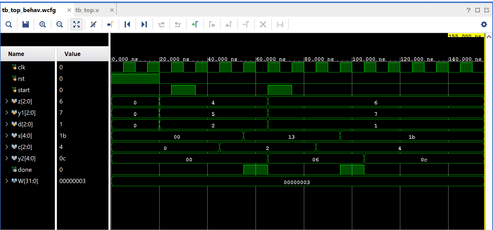

# Equation Solver (Shared-Multiplier Datapath + Controller)

A small control-path / datapath (CP/DP) system that evaluates three
expressions from a shared set of inputs, reusing a single multiplier
resource across FSM states instead of instantiating three separate
multipliers. A classic example of resource sharing in datapath design.

## Contents

1. [Source (`src/top.v`, `src/cp.v`, `src/dp.v`, `src/clk_divider.v`, `src/tb_top.v`)](src)
2. [Constraints (`constraints/EQS3.xdc`)](constraints/EQS3.xdc)
3. [Reports (`reports/`)](reports)
4. [Simulation (`simulation/waveform.png`)](simulation/waveform.png)
5. [Conclusion](CONCLUSION.md)

## What It Computes

Given 3-bit inputs `z`, `y1`, `d` and a `start` pulse, the system computes:

- `x   = 3*y1 + z`
- `c   = 4 / d`
- `y2  = 3*z - 6`

using one shared multiplier (a mux picks `y1` or `z` as its input depending
on FSM state) rather than three separate multiply circuits.

## Architecture

- **`cp.v` (control path):** A 4-state FSM (`IDLE → S1 → S2 → S3 → IDLE`) that sequences the datapath — asserting `sel`, `en_mult`, `en_div`, `en_add`, `en_sub`, `ldA`, `ldB` at the right states, and raising `done` once finished.
- **`dp.v` (datapath):** Holds the actual arithmetic (mux, multiplier, divider, adder, subtractor, and two registers `regA`/`regB`), gated by the control signals from `cp.v`.
- **`top.v`:** Wires `cp` and `dp` together.
- **`clk_divider.v`:** Present in the project but **not currently instantiated** by `top.v` (the instantiation is commented out) — the design runs directly off the input `clk`.

## FSM Sequence

| State | Action |
|-------|--------|
| IDLE | Wait for `start` |
| S1 | `sel=1` (mux picks `y1`), multiply → `regA = 3*y1`; also compute `c = 4/d` |
| S2 | `sel=0` (mux picks `z`), multiply → `regB = 3*z`; also compute `x = regA + z` |
| S3 | Compute `y2 = regB - 6`; assert `done` |

## Testbench

`src/tb_top.v` runs two test cases back-to-back:
1. `z=4, y1=5, d=2` → expected `x=19, c=2, y2=6`
2. `z=6, y1=7, d=1` → expected `x=27, c=4, y2=12`

## Simulation Waveform

Captured from Vivado's Behavioral Simulation waveform viewer, running
`tb_top.v` against the design. The waveform confirms both test cases:
`x=0x13(19), c=2, y2=0x06(6)` for the first, and `x=0x1b(27), c=4,
y2=0x0c(12)` for the second — both matching the expected values above.

## Files

- `src/top.v` — Top-level module wiring `cp` and `dp` together.
- `src/cp.v` — Control path (FSM).
- `src/dp.v` — Datapath (shared-multiplier arithmetic).
- `src/clk_divider.v` — Present in the project but not currently used by `top.v`.
- `src/tb_top.v` — Testbench with 2 directed test cases.
- `constraints/EQS3.xdc` — Pin/IO constraints used for implementation on the target FPGA.
- `reports/utilization.rpt` — Post-synthesis resource utilization report.
- `reports/timing.rpt` — Post-implementation timing summary.
- `reports/power.rpt` — Post-implementation power summary.
- `simulation/waveform.png` — Vivado behavioral simulation waveform.

## Tools Used

- Xilinx Vivado 2025.1
- Target device: xc7s50csga324-1

## How to Reproduce

1. Open Vivado and create a new RTL project.
2. Add `src/top.v`, `src/cp.v`, `src/dp.v` as design sources, and `src/tb_top.v` as a simulation source.
3. Add `constraints/EQS3.xdc` as a constraints file.
4. Run Behavioral Simulation to verify functionality against the testbench.
5. Run Synthesis → Implementation → Generate Bitstream.
6. Export the utilization, timing, and power reports into the `reports/` folder.

See `CONCLUSION.md` for a summary of the results.
