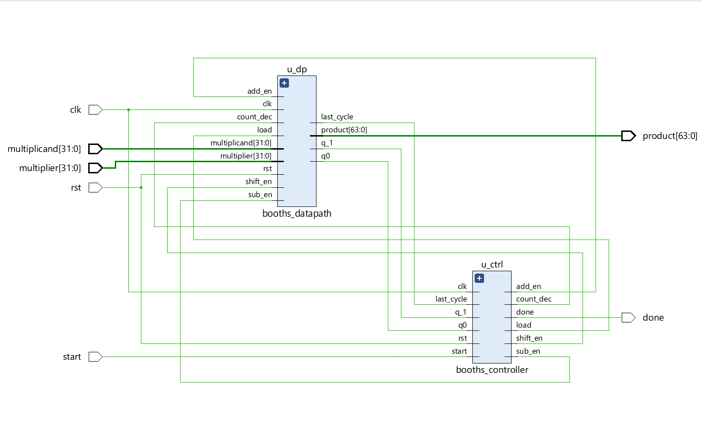
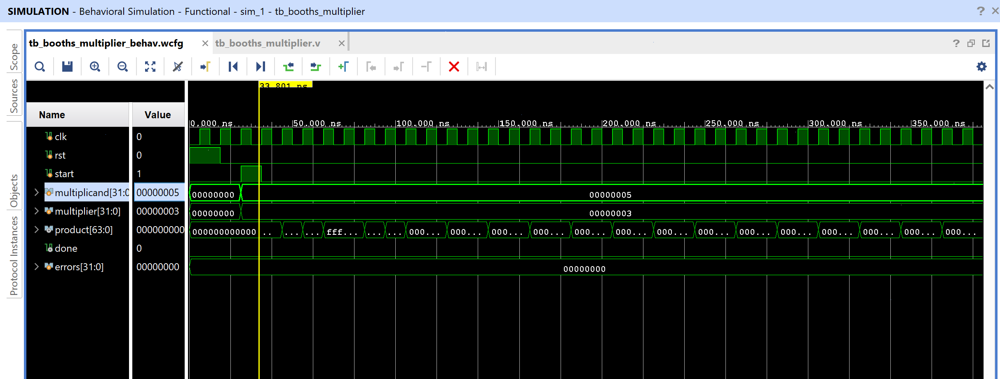

# 32-bit Radix-2 Booth's Multiplier

A control-path / datapath implementation of the classic Booth's
multiplication algorithm: multiplies two 32-bit signed numbers into a
64-bit signed product using repeated add/subtract/shift steps instead of
a combinational array multiplier — trading latency (32 cycles) for much
less hardware.

## Contents

1. [Source (`src/booths_multiplier.v`, `src/booths_controller.v`, `src/booths_datapath.v`, `src/tb_booths_multiplier.v`)](src)
2. [Simulation (`simulation/`)](simulation)
3. [Conclusion](CONCLUSION.md)

> Note: this project doesn't have a synthesized/implemented Vivado run
> associated with it (no constraints file or synthesis/timing/power
> reports were available), so those sections are omitted here — this
> repo entry covers RTL design and simulation only.

## Design

- `clk`, `rst`, `start` — clock, reset, start pulse
- `multiplicand[31:0]`, `multiplier[31:0]` — signed 32-bit operands
- `product[63:0]` — signed 64-bit result
- `done` — asserted for one cycle when the result is ready

## Architecture

- **`booths_controller.v`:** A 5-state FSM (`IDLE → LOAD → ADD_SUB → SHIFT → DONE`) that sequences the datapath, looping `ADD_SUB ⇄ SHIFT` 32 times before asserting `done`.
- **`booths_datapath.v`:** Holds the actual Booth's algorithm state — accumulator `A`, multiplier register `Q`, the extra bit `Q_1`, and the multiplicand register `M` (sign-extended to 33 bits). Each cycle either adds/subtracts `M` into `A` (based on the `{q0,q_1}` bit pair) or arithmetically shifts `{A,Q,Q_1}` right by one, per the standard Radix-2 Booth's recoding rule:

| `{q0,q_1}` | Action |
|------------|--------|
| `01` | `A ← A + M` |
| `10` | `A ← A - M` |
| `00` or `11` | No arithmetic — just shift |

- **`booths_multiplier.v`:** Top-level module wiring the controller and datapath together.

## Block Diagram



Auto-generated schematic showing `booths_controller` and `booths_datapath`
as separate blocks, wired together and exposed as the top-level
`booths_multiplier` module.

## Testbench

`src/tb_booths_multiplier.v` runs 7 directed test cases through a
`run_case` task that computes the expected product in the testbench
itself and compares it against the DUT's output, including negative ×
positive, negative × negative, multiply-by-zero, and both signed extreme
values (`65535 × 65535` and `-2147483648 × 1`):

```
run 10 us
PASS: -5 * 3 = -15
PASS: 5 * -3 = -15
PASS: -5 * -3 = 15
PASS: 0 * 1234 = 0
PASS: 65535 * 65535 = 4294836225
PASS: -2147483648 * 1 = -2147483648
PASS: 123456 * -7891 = -974191296
ALL TESTS PASSED
```

(Full log also saved as `simulation/console_log.txt`.)

## Simulation Waveform



Captured from Vivado's Behavioral Simulation waveform viewer, showing
`multiplicand=5, multiplier=3` computing `product=15` — one of the 7
directed test cases above.

## Files

- `src/booths_multiplier.v` — Top-level module.
- `src/booths_controller.v` — FSM controller.
- `src/booths_datapath.v` — Add/subtract/shift datapath.
- `src/tb_booths_multiplier.v` — Testbench with 7 directed test cases (all passing).
- `simulation/waveform.png` — Vivado behavioral simulation waveform.
- `simulation/schematic.png` — Auto-generated block diagram of controller + datapath.
- `simulation/console_log.txt` — Full testbench console output (all 7 cases pass).

## Tools Used

- Xilinx Vivado 2025.1 (Basys 3 target, per source header — no constraints/implementation run included in this repo entry)

## How to Reproduce

1. Open Vivado and create a new RTL project.
2. Add `src/booths_multiplier.v`, `src/booths_controller.v`, `src/booths_datapath.v` as design sources, and `src/tb_booths_multiplier.v` as a simulation source.
3. Run Behavioral Simulation to verify functionality against the testbench — all 7 test cases should pass.
4. (Optional) Add constraints and run Synthesis/Implementation if targeting real hardware (e.g. Basys 3).

See `CONCLUSION.md` for a summary of the results.
