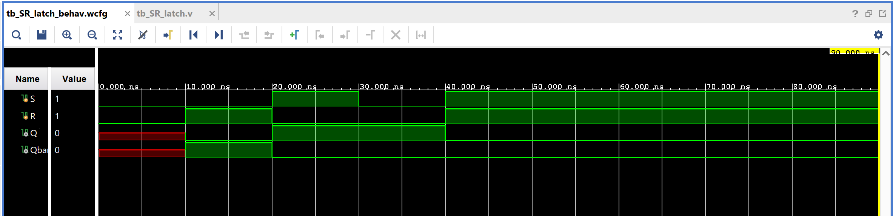

# SR Latch (NOR-based)

The most basic sequential circuit: a 1-bit memory element built from two
cross-coupled NOR gates. Unlike combinational circuits, its output depends
on both current inputs *and* its previous state.

## Contents

1. [Source (`src/SR_latch.v`, `src/tb_SR_latch.v`)](src)
2. [Constraints (`constraints/SR_latch.xdc`)](constraints/SR_latch.xdc)
3. [Reports (`reports/`)](reports)
4. [Simulation (`simulation/waveform.png`)](simulation/waveform.png)
5. [Conclusion](CONCLUSION.md)

## Design

- `S` — set input
- `R` — reset input
- `Q` — latch output
- `Qbar` — complementary output (`~Q`, except in the invalid state)

## Truth Table

| S | R | Q (next)     | Behavior |
|---|---|--------------|----------|
| 0 | 0 | Q (previous) | Hold — retains current state |
| 0 | 1 | 0            | Reset |
| 1 | 0 | 1            | Set |
| 1 | 1 | 0 (both Q, Qbar) | Invalid/forbidden — both outputs forced low |

## Structure

Built from two cross-coupled `nor` gates:
- `nor(Q, R, Qbar)`
- `nor(Qbar, S, Q)`

Each gate's output feeds into the other's input, creating the feedback loop
that gives the latch its memory. The `S=R=1` case is avoided in normal use
since it breaks the `Q = ~Qbar` relationship the latch otherwise maintains.

## Testbench

`src/tb_SR_latch.v` walks through hold → reset → set → hold → invalid,
matching the phases shown in the simulation waveform below.

## Simulation Waveform

Captured from Vivado's Behavioral Simulation waveform viewer
(`tb_SR_latch_behav.wcfg`), running `tb_SR_latch.v` against the design.
The waveform shows the latch moving through hold (initial unknown state,
shown in red) → reset → set → hold → the invalid `S=R=1` state, matching
the testbench sequence described above.

## Files

- `src/SR_latch.v` — NOR-based SR latch.
- `src/tb_SR_latch.v` — Testbench walking through hold/reset/set/invalid.
- `constraints/SR_latch.xdc` — Pin/IO constraints used for implementation on the target FPGA.
- `reports/utilization.rpt` — Post-synthesis resource utilization report.
- `reports/timing.rpt` — Post-implementation timing summary.
- `reports/power.rpt` — Post-implementation power summary.
- `simulation/waveform.png` — Vivado behavioral simulation waveform.

## Tools Used

- Xilinx Vivado 2025.1
- Target device: xc7s50csga324-1

## How to Reproduce

1. Open Vivado and create a new RTL project.
2. Add `src/SR_latch.v` as a design source and `src/tb_SR_latch.v` as a simulation source.
3. Add `constraints/SR_latch.xdc` as a constraints file.
4. Run Behavioral Simulation to verify functionality against the testbench.
5. Run Synthesis → Implementation → Generate Bitstream.
6. Export the utilization, timing, and power reports into the `reports/` folder.

See `CONCLUSION.md` for a summary of the results.
