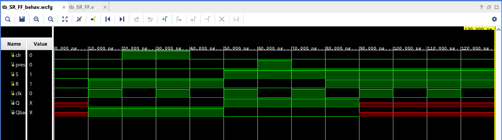

# SR Flip-Flop (Edge-Triggered, with Clear/Preset)

A clocked, edge-triggered version of the SR latch: instead of responding
immediately to `S`/`R`, this design only updates `Q` on the rising edge of
`clk`. It also adds synchronous `clr` (clear) and `preset` inputs that
override `S`/`R` when active.

## Contents

1. [Source (`src/SR_FF.v`, `src/tb_SR_FF.v`)](src)
2. [Constraints (`constraints/SR_FF.xdc`)](constraints/SR_FF.xdc)
3. [Reports (`reports/`)](reports)
4. [Simulation (`simulation/waveform.png`)](simulation/waveform.png)
5. [Conclusion](CONCLUSION.md)

## Design

- `S`, `R` — set/reset inputs
- `clk` — clock (rising-edge triggered)
- `clr` — synchronous clear (forces `Q = 0`, highest priority)
- `preset` — synchronous preset (forces `Q = 1`, second priority)
- `Q` — flip-flop output
- `Qbar` — complementary output (`~Q`)

## Behavior (on each rising clock edge)

| Priority | Condition | Q (next) |
|----------|-----------|----------|
| 1 (highest) | `clr = 1` | 0 |
| 2 | `preset = 1` | 1 |
| 3 | `S = 1, R = 1` | x (invalid) |
| 4 | otherwise | `S \| (~R & Q)` — standard SR behavior |

Unlike the plain SR latch, none of these take effect until the next rising
edge of `clk` — this is what makes it a flip-flop rather than a latch.

## Testbench

`src/tb_SR_FF.v` toggles `clk` every 10ns and walks the design through:
hold → `R=1` (reset on next edge) → `clr` pulse (forces clear regardless of
S/R) → `S=1,R=0` (set) → `preset` pulse (forces set) → `R=1` again (reset).

## Simulation Waveform

Captured from Vivado's Behavioral Simulation waveform viewer
(`tb_SR_FF_behav.wcfg`), running `tb_SR_FF.v` against the design. Note `Q`
and `Qbar` start unknown (red) until the first clock edge samples valid
inputs, and go unknown again once `S=R=1` is reached at the end of the
sequence.

## Files

- `src/SR_FF.v` — Edge-triggered SR flip-flop with clear/preset.
- `src/tb_SR_FF.v` — Testbench exercising clear, preset, set, and reset.
- `constraints/SR_FF.xdc` — Pin/IO constraints used for implementation on the target FPGA.
- `reports/utilization.rpt` — Post-synthesis resource utilization report.
- `reports/timing.rpt` — Post-implementation timing summary.
- `reports/power.rpt` — Post-implementation power summary.
- `simulation/waveform.png` — Vivado behavioral simulation waveform.

## Tools Used

- Xilinx Vivado 2025.1
- Target device: xc7s50csga324-1

## How to Reproduce

1. Open Vivado and create a new RTL project.
2. Add `src/SR_FF.v` as a design source and `src/tb_SR_FF.v` as a simulation source.
3. Add `constraints/SR_FF.xdc` as a constraints file.
4. Run Behavioral Simulation to verify functionality against the testbench.
5. Run Synthesis → Implementation → Generate Bitstream.
6. Export the utilization, timing, and power reports into the `reports/` folder.

See `CONCLUSION.md` for a summary of the results.
