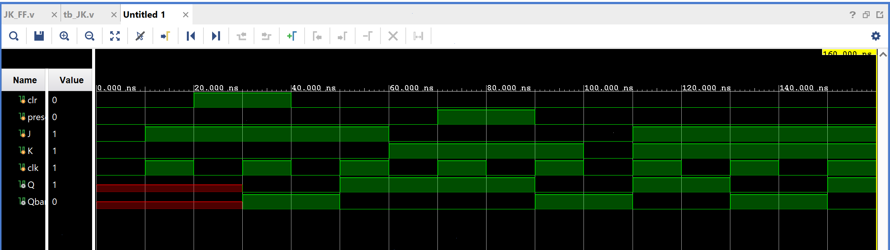

# JK Flip-Flop (with Clear/Preset)

An edge-triggered flip-flop that resolves the SR flip-flop's invalid
`S=R=1` case: instead of going undefined, `J=K=1` makes the JK flip-flop
**toggle** its output on every clock edge.

## Contents

1. [Source (`src/JK_FF.v`, `src/tb_JK.v`)](src)
2. [Constraints (`constraints/JK_FF.xdc`)](constraints/JK_FF.xdc)
3. [Reports (`reports/`)](reports)
4. [Simulation (`simulation/waveform.png`)](simulation/waveform.png)
5. [Conclusion](CONCLUSION.md)

## Design

- `J`, `K` — control inputs
- `clk` — clock (rising-edge triggered)
- `clr` — synchronous clear (forces `Q = 0`, highest priority)
- `preset` — synchronous preset (forces `Q = 1`, second priority)
- `Q` — flip-flop output
- `Qbar` — complementary output (`~Q`)

## Behavior (on each active clock edge)

| Priority | Condition | Q (next) |
|----------|-----------|----------|
| 1 (highest) | `clr = 1` | 0 |
| 2 | `preset = 1` | 1 |
| 3 | otherwise | `(~K & Q) \| (~Q & J)` — standard JK behavior, including toggle when `J=K=1` |

| J | K | Q (next) | Behavior |
|---|---|----------|----------|
| 0 | 0 | Q (hold) | No change |
| 0 | 1 | 0 | Reset |
| 1 | 0 | 1 | Set |
| 1 | 1 | ~Q | Toggle |

## ⚠️ Note on the Internal Clock Divider

The source includes a 27-bit counter (`cnt`) intended to divide `clk` down
to a much slower `clk_out = cnt[26]`, which the flip-flop logic is written
to trigger from instead of `clk` directly. However, the captured simulation
waveform below shows `Q` responding on nearly every `clk` edge, not once
every 2²⁶ cycles as the divider would imply — suggesting the divider isn't
actually gating the flip-flop's update rate as written, at least not within
this simulation window. Worth double-checking if a slow clock was actually
intended here, or if `clk_out` should be removed and the flip-flop should
trigger directly from `clk`.

## Testbench

`src/tb_JK.v` toggles `clk` every 10ns and walks the design through:
hold → `J=1` (set) → `clr` pulse → `J=1,K=0` (set) → `J=0,K=1` (reset) →
`preset` pulse → `K=0` → `J=1,K=1` (toggle).

## Simulation Waveform

Captured from Vivado's Behavioral Simulation waveform viewer, running
`tb_JK.v` against the design.

## Files

- `src/JK_FF.v` — Edge-triggered JK flip-flop with clear/preset (and an internal clock divider — see note above).
- `src/tb_JK.v` — Testbench exercising clear, preset, set, reset, and toggle.
- `constraints/JK_FF.xdc` — Pin/IO constraints used for implementation on the target FPGA.
- `reports/utilization.rpt` — Post-synthesis resource utilization report.
- `reports/timing.rpt` — Post-implementation timing summary.
- `reports/power.rpt` — Post-implementation power summary.
- `simulation/waveform.png` — Vivado behavioral simulation waveform.

## Tools Used

- Xilinx Vivado 2025.1
- Target device: xc7s50csga324-1

## How to Reproduce

1. Open Vivado and create a new RTL project.
2. Add `src/JK_FF.v` as a design source and `src/tb_JK.v` as a simulation source.
3. Add `constraints/JK_FF.xdc` as a constraints file.
4. Run Behavioral Simulation to verify functionality against the testbench.
5. Run Synthesis → Implementation → Generate Bitstream.
6. Export the utilization, timing, and power reports into the `reports/` folder.

See `CONCLUSION.md` for a summary of the results.
