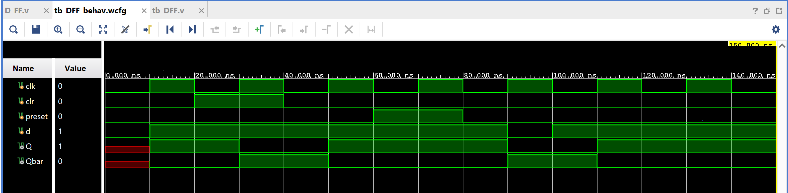

# D Flip-Flop (with Clear/Preset)

The simplest and most widely used flip-flop: on each rising clock edge, `Q`
simply takes on the value of `D`. Unlike SR or JK, there's only one data
input, so there's no invalid or toggle case to worry about.

## Contents

1. [Source (`src/D_FF.v`, `src/tb_DFF.v`)](src)
2. [Constraints (`constraints/D_FF.xdc`)](constraints/D_FF.xdc)
3. [Reports (`reports/`)](reports)
4. [Simulation (`simulation/waveform.png`)](simulation/waveform.png)
5. [Conclusion](CONCLUSION.md)

## Design

- `d` — data input
- `clk` — clock (rising-edge triggered)
- `clr` — synchronous clear (forces `Q = 0`, highest priority)
- `preset` — synchronous preset (forces `Q = 1`, second priority)
- `Q` — flip-flop output
- `Qbar` — complementary output (`~Q`)

## Behavior (on each rising clock edge)

| Priority | Condition | Q (next) |
|----------|-----------|----------|
| 1 (highest) | `clr = 1` | 0 |
| 2 | `preset = 1` | 1 |
| 3 | otherwise | `d` |

## Testbench

`src/tb_DFF.v` toggles `clk` every 10ns and walks the design through:
`d=1` → `clr` pulse → `d=1` again → `preset` pulse → `d=0` → `d=1`.

## Simulation Waveform

Captured from Vivado's Behavioral Simulation waveform viewer
(`tb_DFF_behav.wcfg`), running `tb_DFF.v` against the design.

## Files

- `src/D_FF.v` — Edge-triggered D flip-flop with clear/preset.
- `src/tb_DFF.v` — Testbench exercising clear, preset, and data changes.
- `constraints/D_FF.xdc` — Pin/IO constraints used for implementation on the target FPGA.
- `reports/utilization.rpt` — Post-synthesis resource utilization report.
- `reports/timing.rpt` — Post-implementation timing summary.
- `reports/power.rpt` — Post-implementation power summary.
- `simulation/waveform.png` — Vivado behavioral simulation waveform.

## Tools Used

- Xilinx Vivado 2025.1
- Target device: xc7s50csga324-1

## How to Reproduce

1. Open Vivado and create a new RTL project.
2. Add `src/D_FF.v` as a design source and `src/tb_DFF.v` as a simulation source.
3. Add `constraints/D_FF.xdc` as a constraints file.
4. Run Behavioral Simulation to verify functionality against the testbench.
5. Run Synthesis → Implementation → Generate Bitstream.
6. Export the utilization, timing, and power reports into the `reports/` folder.

See `CONCLUSION.md` for a summary of the results.
