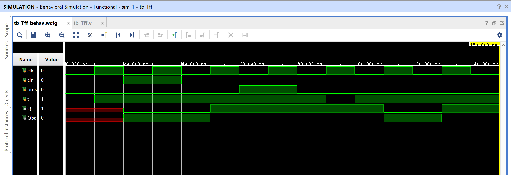

# T Flip-Flop (with Asynchronous Clear, Synchronous Preset)

A flip-flop with a single "toggle" input: when `t=1`, `Q` flips on every
clock edge; when `t=0`, `Q` holds. Equivalent to a JK flip-flop with `J`
and `K` tied together.

## Contents

1. [Source (`src/T_FF.v`, `src/tb_Tff.v`)](src)
2. [Constraints (`constraints/T_FF.xdc`)](constraints/T_FF.xdc)
3. [Reports (`reports/`)](reports)
4. [Simulation (`simulation/waveform.png`)](simulation/waveform.png)
5. [Conclusion](CONCLUSION.md)

## Design

- `t` — toggle input
- `clk` — clock (rising-edge triggered)
- `clr` — clear (forces `Q = 0`) — **asynchronous**, see note below
- `preset` — preset (forces `Q = 1`) — synchronous, only sampled on a clock edge
- `Q` — flip-flop output
- `Qbar` — complementary output (`~Q`)

## Behavior

| Priority | Condition | Q (next) |
|----------|-----------|----------|
| 1 (highest) | `clr = 1` | 0 (takes effect immediately, not on a clock edge) |
| 2 | `preset = 1` (sampled at clock edge) | 1 |
| 3 | otherwise | `t ^ Q` — hold if `t=0`, toggle if `t=1` |

## ⚠️ Note: Asynchronous Clear, Synchronous Preset

The sensitivity list is `always @(posedge clk or posedge clr)` — so `clr`
is **asynchronous**: it forces `Q = 0` the moment it goes high, independent
of the clock. `preset`, however, is only checked inside the clocked branch,
so it only takes effect on the next rising edge of `clk`. This is a real
asymmetry between the two control inputs, unlike the [D flip-flop](../04_D_FF)
and [SR flip-flop](../02_SR_FF) in this repo, where both `clr` and `preset`
are purely synchronous.

## Testbench

`src/tb_Tff.v` toggles `clk` every 10ns and walks the design through:
`t=1` (toggle) → `clr` pulse → `t=1` again → `preset` pulse → `t=0`
(hold) → `t=1` (toggle again).

## Simulation Waveform

Captured from Vivado's Behavioral Simulation waveform viewer
(`tb_Tff_behav.wcfg`), running `tb_Tff.v` against the design.

## Files

- `src/T_FF.v` — T flip-flop with asynchronous clear, synchronous preset.
- `src/tb_Tff.v` — Testbench exercising clear, preset, and toggle.
- `constraints/T_FF.xdc` — Pin/IO constraints used for implementation on the target FPGA.
- `reports/utilization.rpt` — Post-synthesis resource utilization report.
- `reports/timing.rpt` — Post-implementation timing summary.
- `reports/power.rpt` — Post-implementation power summary.
- `simulation/waveform.png` — Vivado behavioral simulation waveform.

## Tools Used

- Xilinx Vivado 2025.1
- Target device: xc7s50csga324-1

## How to Reproduce

1. Open Vivado and create a new RTL project.
2. Add `src/T_FF.v` as a design source and `src/tb_Tff.v` as a simulation source.
3. Add `constraints/T_FF.xdc` as a constraints file.
4. Run Behavioral Simulation to verify functionality against the testbench.
5. Run Synthesis → Implementation → Generate Bitstream.
6. Export the utilization, timing, and power reports into the `reports/` folder.

See `CONCLUSION.md` for a summary of the results.
