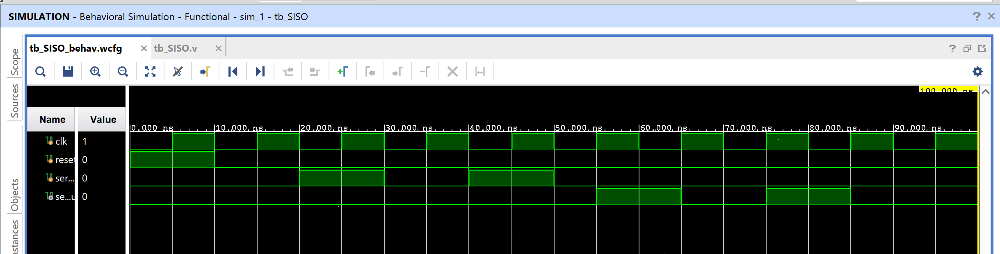

# SISO (Serial-In Serial-Out) Shift Register

A parameterized shift register that accepts one bit per clock on
`serial_in` and, after `DEPTH` clock cycles, produces that same bit on
`serial_out`. Classic building block for serial communication links,
delay lines, and as the base case of the shift-register family
(SISO → SIPO → PISO → PIPO → [Universal Shift Register](../.. "see universal shift register module in this repo")).

## Contents

1. [Source (`src/SISO_SR.v`, `src/tb_SISO_SR.v`)](src)
2. [Constraints (`constraints/SISO_SR.xdc`)](constraints/SISO_SR.xdc)
3. [Reports (`reports/`)](reports)
4. [Simulation (`simulation/waveform.png`)](simulation/waveform.png)
5. [Conclusion](CONCLUSION.md)

## Design

- `clk` — clock (rising-edge triggered)
- `rst` — synchronous, active-high reset (clears all stages to 0)
- `en` — shift enable (register holds its value when `en=0`)
- `serial_in` — one bit in per clock
- `serial_out` — one bit out per clock, delayed by `DEPTH` cycles
- `DEPTH` — parameter, number of flip-flop stages (default 8)

## Behavior

| Priority | Condition | Next state |
|----------|-----------|------------|
| 1 (highest) | `rst = 1` | all stages cleared to 0 (synchronous) |
| 2 | `en = 1` | shift left by one; `serial_in` enters bit 0, `serial_out` = old bit `DEPTH-1` |
| 3 | `en = 0` | hold — no change |

Internally: `shift_reg <= {shift_reg[DEPTH-2:0], serial_in}`. A bit
entering at cycle *n* appears on `serial_out` at cycle *n + DEPTH*
(inclusive of the shift that first captures it) — a fixed-latency
delay line of length `DEPTH`.

## ⚠️ Note: Reset and Enable Are Both Fully Synchronous

Unlike the [T flip-flop](../05_T_FF) in this repo, which uses an
**asynchronous** clear, this design keeps both `rst` and `en` purely
synchronous — sampled only on the rising edge of `clk`. This is the
more common convention for FPGA shift-register / FIFO-style datapaths,
since it avoids reset-recovery timing concerns during STA closure.

## Testbench

`src/tb_SISO_SR.v` toggles `clk` every 10ns and:
1. Confirms `rst` clears the register.
2. Shifts in a known 16-bit test pattern, one bit per cycle.
3. Once `DEPTH` bits have entered, checks that `serial_out` reproduces
   the pattern with the correct `DEPTH`-cycle latency, bit for bit.
4. Confirms `en = 0` freezes the register (no further shifting).

A `#1` settle delay is inserted after every `@(posedge clk)` before
changing inputs or reading `serial_out`, to avoid a zero-delay race
between the testbench's input updates and the DUT's clocked always
block sampling on the same edge.

## Simulation Waveform

Captured from Vivado's Behavioral Simulation waveform viewer.

## Files

- `src/SISO_SR.v` — Parameterized SISO shift register.
- `src/tb_SISO_SR.v` — Testbench exercising reset, shift latency, and enable gating.
- `constraints/SISO_SR.xdc` — Pin/IO constraints (update LOC values for your target board).
- `reports/utilization.rpt` — Post-synthesis resource utilization report.
- `reports/timing.rpt` — Post-implementation timing summary.
- `reports/power.rpt` — Post-implementation power summary.
- `simulation/waveform.png` — Vivado behavioral simulation waveform.

## Tools Used

- Xilinx Vivado 2025.1
- Target device: xc7s50csga324-1

## How to Reproduce

1. Open Vivado and create a new RTL project.
2. Add `src/SISO_SR.v` as a design source and `src/tb_SISO_SR.v` as a simulation source.
3. Add `constraints/SISO_SR.xdc` as a constraints file.
4. Run Behavioral Simulation to verify functionality against the testbench.
5. Run Synthesis → Implementation → Generate Bitstream.
6. Export the utilization, timing, and power reports into the `reports/` folder.

See `CONCLUSION.md` for a summary of the results.
