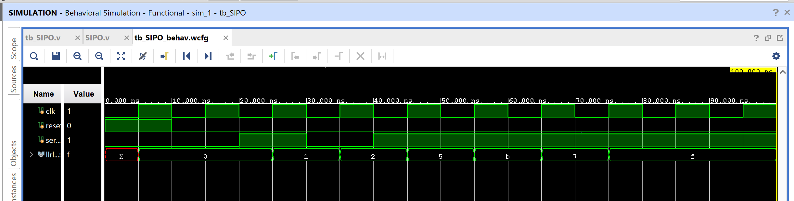

# SIPO (Serial-In Parallel-Out) Shift Register

A 4-bit shift register that accepts one bit per (divided) clock on
`serial_in` and exposes all 4 stages in parallel on `llrl_out[3:0]`.
Includes an on-board clock divider so the shift is visible to the eye
on LEDs when run on real hardware, rather than blinking at 100 MHz.

## Contents

1. [Source (`src/SIPO.v`, `src/tb_SIPO.v`, `src/tb_SIPO_fast.v`)](src)
2. [Constraints (`constraints/SIPO.xdc`)](constraints/SIPO.xdc)
3. [Reports (`reports/`)](reports)
4. [Simulation (`simulation/waveform.png`)](simulation/waveform.png)
5. [Conclusion](CONCLUSION.md)

## Design

- `clk` — 100 MHz board clock
- `reset` — synchronous, active-high (clears both the divider and the shift stages)
- `serial_in` — one bit in per divided clock period
- `llrl_out[3:0]` — parallel output; `llrl_out[3]` = first bit shifted in, `llrl_out[0]` = most recent bit
- `DIV_BITS` (parameter, default 26) — clock-divider width. At 100 MHz and `DIV_BITS=26`, the shift clock (`clk_out`) has a period of roughly 0.67s, so each new bit is visibly latched on the board's LEDs.

## Behavior

| Priority | Condition | Next state |
|----------|-----------|------------|
| 1 | `reset = 1` | divider counter and all 4 shift stages cleared to 0 |
| 2 | `clk_out` rising edge, `reset = 0` | shift left: `serial_in` enters `q0`, `q0→q1→q2→q3`, oldest bit exits |

`clk_out` is derived from the MSB of a free-running divider counter
(`cnt[DIV_BITS-1]`), itself synchronously reset alongside the shift
stages.

## ⚠️ Notes on Two Issues Found and Fixed

The version originally synthesized in Vivado had two subtle bugs,
fixed in this repo copy (utilization/timing/power below are from the
**original** synthesized/implemented run, since neither fix changes
resource usage or timing — both are purely functional corrections):

1. **Dead code:** the divider counter had two non-blocking assigns to
   `cnt` in the same always block (`cnt <= 27'b00;` followed
   immediately by `cnt <= cnt + 1'b1;`). Only the last assignment in
   program order takes effect for a given variable in the same
   time step, so the reset line was silently dead — harmless
   (matches the reports below), but confusing to read.
2. **Uninitialized counter → permanent `X` in simulation:** `cnt` was
   never reset anywhere, so in behavioral simulation `cnt <= cnt + 1`
   starting from an unknown value propagates `X` forever, and
   `llrl_out` never resolves to a real value no matter how long the
   testbench runs. Fixed by synchronously resetting `cnt` whenever
   `reset` is asserted — this also makes the design's power-up
   behavior well-defined on real hardware, rather than relying on
   FPGA configuration-time initial values.

Separately (not a bug, just a simulation-practicality note): with the
hardware-default `DIV_BITS=26`, `clk_out` only toggles roughly once
every 67 million `clk` edges — completely correct for a human-visible
LED blink, but far too slow to observe in a short behavioral
simulation. `src/tb_SIPO_fast.v` overrides `DIV_BITS=3` to verify the
same shift logic in a few hundred nanoseconds; `src/tb_SIPO.v` (yours,
unmodified) remains as the hardware-parity reference at the real
divider width.

## Testbenches

- `src/tb_SIPO.v` — original testbench, `DIV_BITS=26` (hardware
  default). Useful for confirming pin/parameter wiring, but will show
  `llrl_out = xxxx` for any realistic simulation length — this is
  expected, not a failure.
- `src/tb_SIPO_fast.v` — `DIV_BITS=3` override; drives 4 known bits
  (`1,0,1,1`) into `serial_in` and confirms `llrl_out = 1011` once all
  4 have shifted through.

## Simulation Waveform

*(waveform pending — export from Vivado's Behavioral Simulation
viewer, ideally using `tb_SIPO_fast.v` so the shift is actually
visible in the trace)*

## Files

- `src/SIPO.v` — SIPO shift register with parametrized clock divider (bugfixed).
- `src/tb_SIPO.v` — Original hardware-parity testbench (`DIV_BITS=26`).
- `src/tb_SIPO_fast.v` — Fast functional-verification testbench (`DIV_BITS=3`).
- `constraints/SIPO.xdc` — Pin/IO constraints (Arty A7-35T-class board, `xc7a35ticpg236-1L`).
- `reports/utilization.rpt` — Post-implementation resource utilization report.
- `reports/timing.rpt` — Post-implementation timing summary.
- `reports/power.rpt` — Post-implementation power summary.
- `simulation/waveform.png` — Vivado behavioral simulation waveform.

## Tools Used

- Xilinx Vivado 2025.1
- Target device: xc7a35ticpg236-1L

## How to Reproduce

1. Open Vivado and create a new RTL project.
2. Add `src/SIPO.v` as a design source.
3. For a quick functional check, add `src/tb_SIPO_fast.v` as the
   simulation source and run Behavioral Simulation — you should see
   `llrl_out` reach `1011` partway through the trace.
4. Add `constraints/SIPO.xdc` as a constraints file.
5. Run Synthesis → Implementation → Generate Bitstream (this uses the
   hardware-default `DIV_BITS=26` since no override is applied at the
   top level).
6. Export the utilization, timing, and power reports into the
   `reports/` folder.

See `CONCLUSION.md` for a summary of the results.
