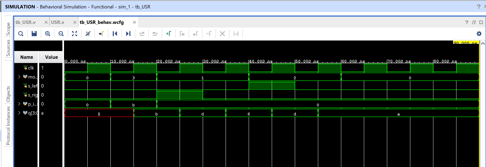

# Universal Shift Register (USR)

A 4-bit register that can hold, shift left, shift right, or parallel
load on every clock edge, selected by a 2-bit `mode` input. This ties
together every shift-register variant already in this repo — SISO,
SIPO, and (implicitly) PISO/PIPO are all just this design with a
subset of `mode` fixed.

## Contents

1. [Source (`src/USR.v`, `src/tb_USR.v`)](src)
2. [Constraints (`constraints/USR.xdc`)](constraints/USR.xdc)
3. [Reports (`reports/`)](reports)
4. [Simulation (`simulation/waveform.png`)](simulation/waveform.png)
5. [Conclusion](CONCLUSION.md)

## Design

- `clk` — clock (rising-edge triggered)
- `mode[1:0]` — operation select (see table below)
- `s_left` — serial bit entering on a shift-left
- `s_right` — serial bit entering on a shift-right
- `p_in[3:0]` — parallel load data
- `q[3:0]` — register output

## Behavior

| `mode` | Operation | Next state |
|--------|-----------|------------|
| `00` | Hold | `q <= q` |
| `01` | Shift Right | `q <= {s_right, q[3:1]}` — `s_right` enters at MSB, `q[0]` exits |
| `10` | Shift Left | `q <= {q[2:0], s_left}` — `s_left` enters at LSB, `q[3]` exits |
| `11` | Parallel Load | `q <= p_in` |

There is no dedicated reset — `q` is undefined until the first
parallel load or shift, matching the design as synthesized and
tested. This is standard for a lot of small FPGA demo designs
(FPGA flip-flops do get a defined configuration-time value), but
if this were feeding a larger datapath a synchronous reset would be
worth adding for simulation/verification hygiene.

## Testbench

`src/tb_USR.v` walks through all four modes in sequence: parallel
load `4'b1011`, shift right twice, shift left twice, then hold —
printing `mode`, `p_in`, `s_left`, `s_right`, and `q` after each step.

## Simulation Waveform

Captured from Vivado's Behavioral Simulation waveform viewer. `q`
progresses `x → b → d → 6 → d → a` (hex) exactly as expected:
parallel-load `1011`, shift right (`1101`), shift right again
(`0110`), shift left (`1101`), shift left again (`1010`), then hold.
Verified bit-for-bit against a standalone simulation of the same
RTL/testbench pair — see `CONCLUSION.md`.

## Files

- `src/USR.v` — Universal shift register (hold/shift-right/shift-left/parallel-load).
- `src/tb_USR.v` — Testbench exercising all four modes in sequence.
- `constraints/USR.xdc` — Pin/IO constraints (Arty A7-35T-class board, `xc7a35ticpg236-1L`).
- `reports/utilization.rpt` — Post-implementation resource utilization report.
- `reports/timing.rpt` — Post-implementation timing summary.
- `reports/power.rpt` — Post-implementation power summary.
- `simulation/waveform.png` — Vivado behavioral simulation waveform.

## Tools Used

- Xilinx Vivado 2025.1
- Target device: xc7a35ticpg236-1L

## How to Reproduce

1. Open Vivado and create a new RTL project.
2. Add `src/USR.v` as a design source and `src/tb_USR.v` as a simulation source.
3. Add `constraints/USR.xdc` as a constraints file.
4. Run Behavioral Simulation to verify functionality against the testbench.
5. Run Synthesis → Implementation → Generate Bitstream.
6. Export the utilization, timing, and power reports into the `reports/` folder.

See `CONCLUSION.md` for a summary of the results.
