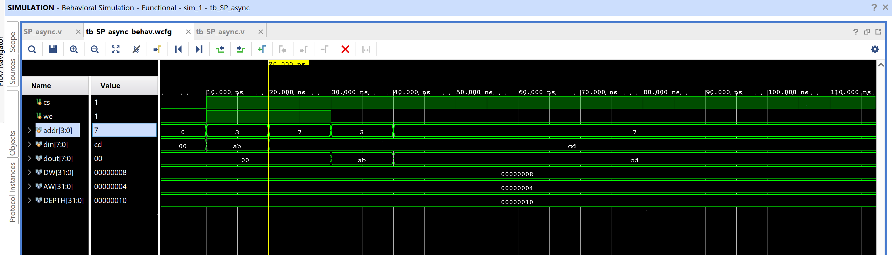

# SP_async — Single-Port Asynchronous RAM

A small single-port memory (default 16 × 8-bit) with **combinational
(asynchronous) read and write** — no clock at all. Reads and writes
both take effect immediately based on `cs`/`we`/`addr`, rather than on
a clock edge. Models the behavior of a classic external async SRAM
chip, as opposed to the clocked/synchronous SRAM and BRAM-based
designs elsewhere in this repo.

## Contents

1. [Source (`src/SP_async.v`, `src/tb_SP_async.v`)](src)
2. [Constraints (`constraints/SP_async.xdc`)](constraints/SP_async.xdc)
3. [Reports (`reports/`)](reports)
4. [Simulation (`simulation/waveform.png`)](simulation/waveform.png)
5. [Conclusion](CONCLUSION.md)

## Design

- `cs` — chip select (must be high for either read or write to occur)
- `we` — write enable (`1` = write, `0` = read)
- `addr[AW-1:0]` — address (default `AW=4`, so 16 locations)
- `din[DW-1:0]` — write data (default `DW=8`)
- `dout[DW-1:0]` — read data, combinational — reflects `mem[addr]`
  immediately whenever `cs=1, we=0`; driven to `0` whenever `cs=0` or
  `we=1`
- `DEPTH` (parameter, default 16) — number of addressable words

## Behavior

| `cs` | `we` | Operation |
|------|------|-----------|
| 0 | x | `dout` forced to 0; no write |
| 1 | 1 | `mem[addr] <= din` (write, takes effect immediately) |
| 1 | 0 | `dout <= mem[addr]` (read, combinational) |

## ⚠️ Note: Why This Synthesizes to 128 Latches, Not Block RAM

This is the single most important thing to understand about this
design before using it as a template for anything larger:

**Asynchronous writes cannot map to Block RAM.** Vivado's block RAM
primitives (RAMB18/RAMB36) only support *clocked* writes — the write
port always has a clock input. Since `mem[addr] <= din` here happens
inside a combinational `always @(*)` block with no clock at all,
Vivado has no choice but to infer **one latch per storage bit** to
hold the value: `16 words × 8 bits = 128 latches`, confirmed exactly
in `reports/utilization.rpt` (`Register as Latch: 128`, `Block RAM
Tile: 0`).

This is a legitimate and common way to model an external asynchronous
SRAM chip's *interface behavior* in simulation/verification, but if
the goal were an FPGA-efficient synchronous memory, this would need a
`posedge clk`-triggered write (and, for genuine BRAM inference, a
registered read too) — see the single-port/dual-port synchronous RAM
designs elsewhere in this repo for that style. Latch-based storage
also carries the usual latch risks on real hardware: sensitivity to
glitches on `addr`/`cs`/`we` during the transparent (non-write)
period, and no defined power-up state.

There's also no `create_clock` needed in the XDC here — the design is
purely combinational, so "WNS = inf" in the timing report is expected
and correct, not a missing-constraint issue like the last couple of
modules.

## Testbench

`src/tb_SP_async.v` writes `0xAB` to address `3` and `0xCD` to address
`7`, then reads both back and confirms `dout` matches.

## Simulation Waveform

Captured from Vivado's Behavioral Simulation waveform viewer. Shows
two writes (`addr=3, din=ab` then `addr=7, din=cd`) followed by two
reads (`addr=3` → `dout=ab`, `addr=7` → `dout=cd`), confirming correct
asynchronous read-after-write behavior. Verified bit-for-bit against a
standalone simulation of the same RTL — see `CONCLUSION.md`.

## Files

- `src/SP_async.v` — Single-port asynchronous RAM.
- `src/tb_SP_async.v` — Testbench: write two locations, read both back.
- `constraints/SP_async.xdc` — Pin/IO constraints (Arty A7-35T-class board, `xc7a35ticpg236-1L`).
- `reports/utilization.rpt` — Post-implementation resource utilization report (confirms latch-based, not BRAM, inference).
- `reports/timing.rpt` — Post-implementation timing summary.
- `reports/power.rpt` — Post-implementation power summary.
- `simulation/waveform.png` — Vivado behavioral simulation waveform.

## Tools Used

- Xilinx Vivado 2025.1
- Target device: xc7a35ticpg236-1L

## How to Reproduce

1. Open Vivado and create a new RTL project.
2. Add `src/SP_async.v` as a design source and `src/tb_SP_async.v` as a simulation source.
3. Add `constraints/SP_async.xdc` as a constraints file.
4. Run Behavioral Simulation to verify functionality against the testbench.
5. Run Synthesis → Implementation → Generate Bitstream.
6. Export the utilization, timing, and power reports into the `reports/` folder.

See `CONCLUSION.md` for a summary of the results.
